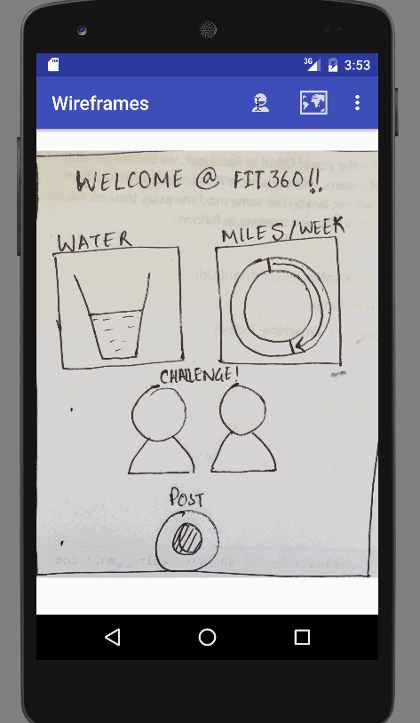

Fit360
==============

An all rounded fitness app that uses your social connections to motivate you.

==============

####Required user stories-
###Home Page
- [x] The user can enter daily tracking items like water, activity etc.
- [x] They can use the camera button to upload pictures to the community/personal feed

###Profile Page
- [x] User create a profile and enter basic information like stats and bio.
- [x] User can view a list of their friends connected through this app
- [x] User can view their own feed.

###Map Page
- [x] The user can see nearby friends or other people working on similar activities
- [x] They can chat with each other and schedule a time to workout together.

###Community Page
- [x] The user can browse through the community feed to get inspiration(before and after pictures) and ideas about meal prep etc.

###Chats Page
- [x] The user can connect with their friends and exchange messages on this page.

####Optionals
- [x] Onboarding screen to enter personalized data.
- [x] Show different types of feeds for different users(using a/b testing)

####Preview-

